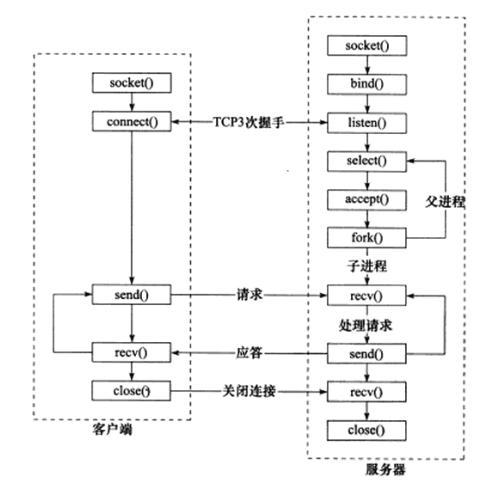
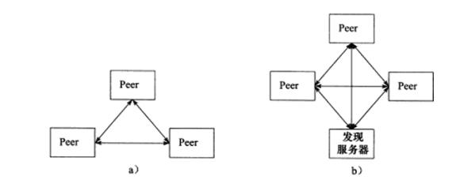
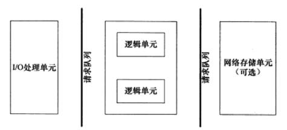
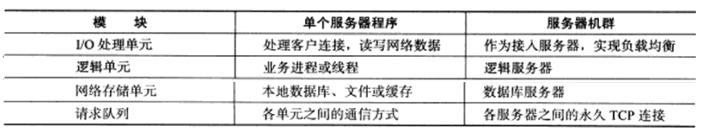
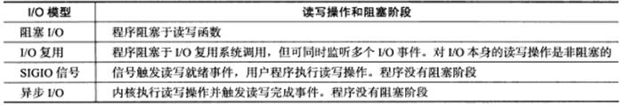
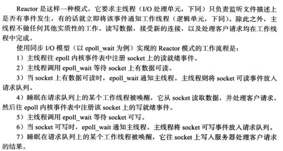
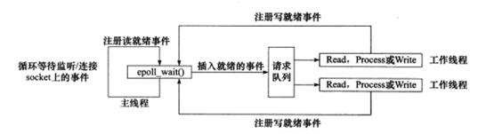
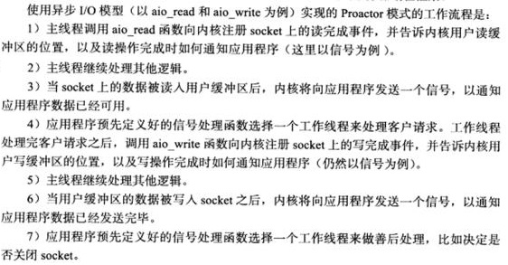
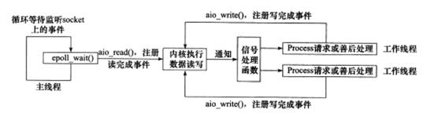
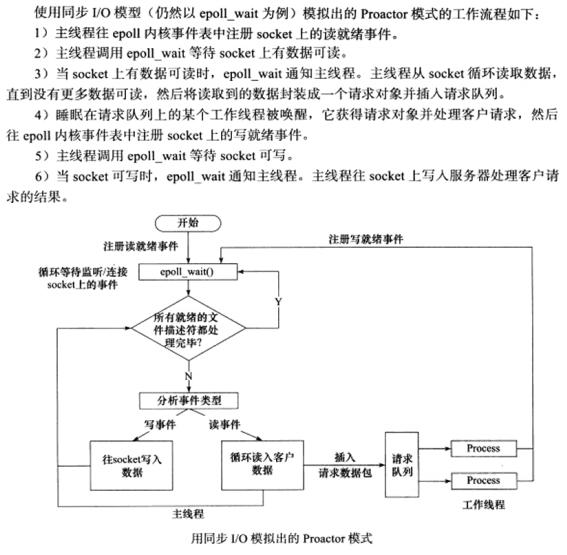

# boost库 asio学习 boost_1_63

# 高性能服务器程序框架 基础知识复习 （书籍 Linux高性能服务器编程）
- 按照服务器一般原理，可将服务器解构为以下三个主要模块：
    1. I/O处理单元。
    2. 逻辑单元。
    3. 存储单元。

## 1 服务器模型
### 1.1 C/S模型
- C/S(客户端/服务器)模型：所有客户端都通过访问服务器来获取所需的资源。

- C/S模型适合资源相对集中的场合，其实现也很简单，缺点明显：服务器是通信的中心，当访问量很大时，所有客户都讲得到很慢的响应。
### 1.2 P2P模型
- P2P(点对点)模型摒弃了以服务器为中心的格局，让网络上所有主机重新回归对等的地位。P2P模型让每台机器在消耗服务的同时也在给别人提供服务，让资源充分、自由地共享。缺点：当用户之间传输的请求过多时，网络的负载将加重。P2P模式通常带有一个专门的发现服务器，提供查找服务甚至提供内容服务，让每个客户尽快地找到自己需要的资源。P2P模型可以看做C/S模型的扩展：每台主机既是客户端，也是服务器。

## 2 服务器编程框架
- 服务器基本框架都一样，不同在于逻辑处理。

- I/O处理单元是服务器管理客户连接的模块。主要工作：1.等待并接受新的客户连接;2.接收客户数据;3.将服务器响应的数据返回客户端。对于服务器集群，I/O处理单元是一个专门的接入服务器，实现负载均衡，在所有逻辑服务器中选取负荷最小的一台为新客户服务。
- 一个逻辑单元是一个进程或线程，主要工作：分析并处理客户数据，并将结果传递给I/O处理单元或者直接发送给客户端。对服务器集群，一个逻辑单元就是一台逻辑服务器，服务器通常拥有多个逻辑单元，实现对多个客户任务的并行处理。
- 网络存储单元可以是数据库、缓存和文件，甚至一台独立服务器，但它不是必须的。
- 请求队列是各个单元间通信方式的抽象。对服务器集群，请求队列是各台服务器之间预先建立的、静态的、永久的TCP连接，该TCP连接提高服务器间交换数据的效率，避免动态建立TCP连接的额外的系统开销。

## 3 I/O模型
- 阻塞I/O，系统调用可能无法立即完成而被操作系统挂起，直到等待的事件发生为止。socket在创建时默认是阻塞的。通过给socket系统调用第二个参数传递SOCK_NONBLOCK标志，或通过fcntl系统调用的F_SETFL命令，可将socket设置为非阻塞的。对非阻塞I/O的系统调用总是立即返回，而不管事件是否已经发生。非阻塞I/O只有在事件已经发生的情况下操作，才能提高程序效率，因此非阻塞I/O通常和其它I/O通知机制一起使用。
- I/O复用，应用程序通过I/O复用函数向内核注册一组事件，内核通过I/O复用函数把其中就绪的事件通知给应用程序。
- SIGIO信号，为一个目标文件描述符指定宿主进程，被指定的宿主进程将捕获到SIGIO信号。当目标文件描述符上有事件发生时，SIGIO信号的信号处理函数将被触发。
- 理论上：阻塞I/O、I/O复用和信号驱动I/O都是同步I/O模型。因为在以上三种模型中，I/O的读写操作都是在I/O事件发生之后，由应用程序来完成的。
- 对于POSIX规范定义的异步I/O模型，用户可以直接对I/O执行读写操作，读写操作告诉内核用户读写缓冲区的位置，以及I/O操作完成后内核通知应用程序的方式，异步I/O的读写总是立即返回，不论I/O是否阻塞，因为真正的读写操作由内核接管。同步I/O模型要求用户代码自执行I/O操作，而异步I/O由内核来执行I/O操作。同步I/O向应用程序通知的是I/O就绪事件，而异步I/O向引用程序通知的是I/O完成事件。

## 4 两种高效的事件处理模式
- 服务器通常需要处理三类事件:I/O事件、信号及定时器事件。
- 同步I/O模型通常用于Reactor模式，异步I/O模型则用于实现Proactor模式。

### 4.1 Reactor模式

### 4.2 Proactor模式
- Proactor模式将所有I/O操作都交给主线程和内核来处理，工作线程仅仅负责业务逻辑。因此，Proactor模式更加符合服务器基本框架。

### 4.3 模拟Proactor模式
- 使用同步I/O方式模拟Proactor模式，原理：主线程执行数据读写操作，读写完成之后，主线程向工作线程通知这一"完成时间"。从工作线程角度，直接获得了数据读写的结果，下面只是对读写的结果进行逻辑处理。

# Boost.Asio 学习
## 1 入门
- Boost.Asio最核心的类----io_service。
### 1.1 Boost.Asio是什么
- Boost.Asio是一个跨平台、主要用于网络和其他一些底层输入/输出编程的C++库。
- Boost.Asio在网络通信、COM串行端口和文件上成功地抽象了输入输出的概念。
### 1.2 依赖
- Boost.Asio依赖如下库：
    1. Boost.System:为Boost库提供操作系统支持。
    2. Boost.Regex(可选的):以便重载Read_until()或者async_read_until()是使用boost::regex参数。
    3. Boost.DateTime(可选的):以便使用Boost.Asio中的计时器。
    4. OpenSSL(可选的):以便使用Boost.Asio提供的SSL支持。
### 1.3 编译
- Boost.Asio是一个只需要引入头文件就可以使用的库。在某个源文件中，添加#include "boost/asio/impl/src.hpp"(如果你在使用SSL，添加#include "boost/asio/ssl/impl/src.hpp"）在所有的源文件中，添加#define BOOST_ASIO_SEPARATE_COMPILATION
- 注意Boost.Asio依赖于Boost.System，必要的时候还依赖于Boost.Regex。需要编译Boost,使用指令bjam –with-system –with-regex stage。
### 1.4 重要宏
- 如果设置了BOOST_ASIO_DISABLE_THREADS；不管你是否在编译Boost的过程中使用了线程支持，Boost.Asio中的线程支持都会失效。
### 1.5 同步VS异步
- 同步编程，所有操作都是顺序执行。
- 异步编程是事件驱动的。

